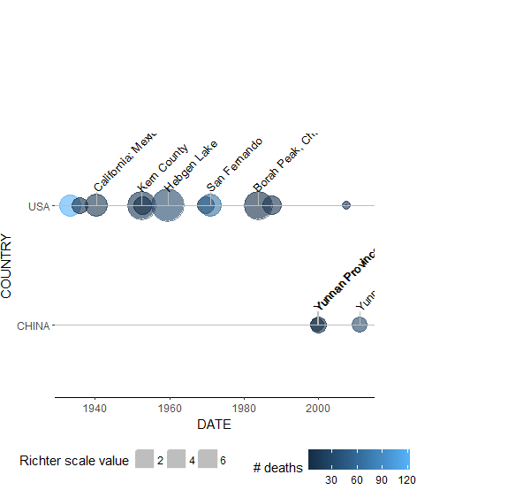
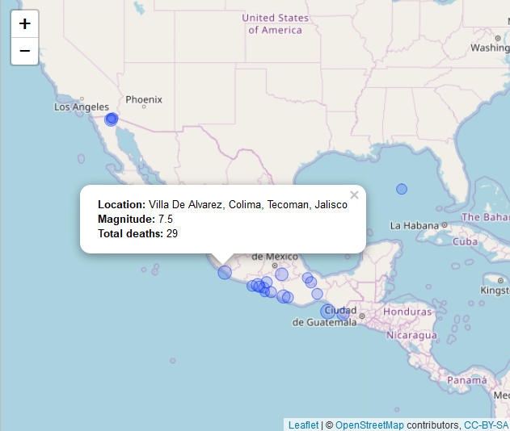

```{r setup, include = FALSE}
knitr::opts_chunk$set(
  collapse = TRUE,
  comment = "#>"
)
```

## Introduction

This package was created as a capstone project for the Coursera course "Mastering Software
Development in R". The package contains functions to clean and visualize earthquake data from the
"U.S. National Oceanographic and Atmospheric Administration" "Significant Earthquakes" data set.
The visualizations include plotting the earthquakes along a timeline as well as on an interactive
map.

## Exported functions

The NOAA package exports 7 functions to the user:

- eq_clean_data
- eq_location_clean
- geom_timeline
- geom_timeline_label
- theme_time
- eq_map
- eq_create_label

The functions "eq_clean_data" and "eq_location_clean" are applied to the raw data set to add a date
column, change datatypes and cleanup text columns so that the data set is ready to be visualized.

The functions "geom_timeline", "geom_timeline_label" and "theme_time" are used on the cleaned data
set to get a ggplot2 layer containing a time line based visualization of the earthquake data.

The function "eq_map" uses leaflet to generate an interactive map based on OpenStreetMap map tiles
with clickable indicators for each earthquake. When clicked, a popup text is displayed.
"eq_create_label" generates a text which can be used as popup text. This text contains information
about the date and magnitude of the earthquake as well as the number of deaths caused by it.

## Acquiring the data set
The NOAA earthquake data set can be downloaded from this
([link](https://www.ngdc.noaa.gov/nndc/struts/form?t=101650&s=1&d=1))

An extract of the data set is also available in this package in the file "inst/extdata/signif.txt"
and it is also this extract which will be used in the examples.

## Cleaning the raw data set example
The two functions "eq_clean_data" and "eq_location_data" can be used in conjunction with the pipe
operator, so that the raw input is read in with for instance the "read_delim" function from the
"readr" package and then piped into the noaa data cleaning functions as shown in the following
example.

```{r read_and_clean, message = FALSE, warning = FALSE}
library(magrittr)
library(noaa)
eq_data <- readr::read_delim(file = system.file("extdata", "signif.txt", package="noaa"),
                             delim = "\t") %>%
  eq_clean_data() %>% eq_location_clean()
```

## Timeline example
The three functions involved in the timeline based visualization of the earthquake data are:
"geom_timeline", "geom_timeline_label" and "theme_time".

The "theme_time" is a simple ggplot theme that beautifies the plot by blanking out the background,
setting the plot margins, placing the legend etc.

The function
"geom_timeline" plots the earthquakes on the timeline given the x argument, stratified by the y
argument and in the following exaxmple the colour aesthetic represents the number of deaths caused
be the earthquakes while the size aesthetic represents the magnitude of the earthquakes.

The function "geom_timeline_label" adds labels to the timeline plot for each of the "n_max"
stratified values with the largest "size" aesthetic. In the following example the size aesthetic is
coupled to the magnitude of the earthquakes and the label aesthetic is coupled to the location name,
so we will get location labels for the "n_max" earthquakes of the largest magnitude for each
country. Since this function only plots the labels and does not plot the actual timeline and the
earthquakes, it does not make sense to use the "geom_timeline_label" without the "geom_timeline".

The functions are meant to be tied together using the pipe operator.

```{r geom_timeline_label, eval = FALSE}
p <- readr::read_delim(file = system.file("extdata", "signif.txt", package="noaa"),
                                         delim = "\t") %>%
  eq_clean_data() %>% eq_location_clean() %>%
  dplyr::filter(YEAR >= 1900, !is.na(DEATHS), !is.na(EQ_MAG_ML),
                COUNTRY %in% c("CHINA", "USA")) %>%
  ggplot2::ggplot(ggplot2::aes(x = DATE,
                               y = COUNTRY,
                               colour = DEATHS,
                               size = EQ_MAG_ML)) +
  theme_time() +
  geom_timeline() +
  geom_timeline_label(ggplot2::aes(label = LOCATION_NAME, n_max = 5)) +
  ggplot2::labs(x = "DATE", color = "# deaths", size = "Richter scale value")
gt <- ggplot2::ggplot_gtable(ggplot2::ggplot_build(p))
gt$layout$clip[gt$layout$name=="panel"] = "off"
grid::grid.draw(gt)
```



## Interactive map example
The two functions used in the interactive map visualization of the earthquake data are "eq_map" and
"eq_create_label". The function "eq_map" uses leaflet to get OpenStreetMap tiles and plot the
latitude/longitude location of the earthquakes with circle markers. The radius of the circle markers
are dependent on the magnitude of the earthquakes.

The data frame "df" given as argument to "eq_map" must have the columns "LONGITUDE", "LATITUDE" and
"EQ_PRIMARY" (the earthquake magnitude). Also, the function takes an argument "annot_col" which
should correspond to a column in "df" and provides the text shown as a popup, when the earthquake
markers are clicked on the interactive map.

The function "eq_create_label" populates the data frame with a column called "popup_text" which
can be used for "annot_col" in the call to "eq_map". This text contains information about the
location name, the magnitude and the number of deaths associated with the earthquake.

```{r eq_map, eval = FALSE}
readr::read_delim(file = system.file("extdata", "signif.txt", package="noaa"), delim = "\t") %>%
eq_clean_data() %>%
dplyr::filter(COUNTRY == "MEXICO" & lubridate::year(DATE) >= 2000) %>%
dplyr::mutate(popup_text = eq_create_label(.)) %>%
eq_map(annot_col = "popup_text")
```




